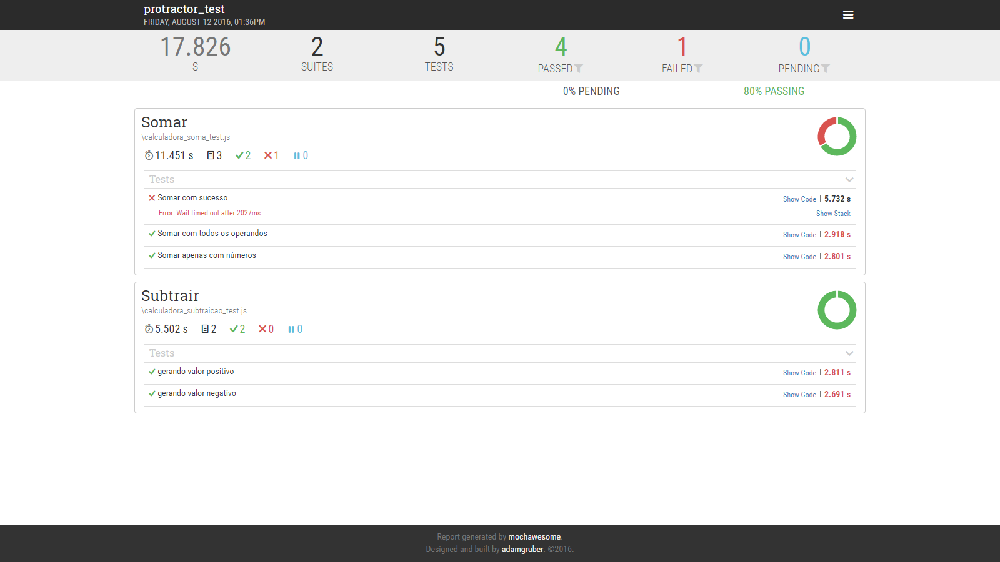

# e2e
Repositório pra validação de conceito do ConceptJS

Este repositório visa de forma objetiva demonstrar uma configuração mínima pra execução de testes de aceitação(conhecido em algumas circunstâncias como e2e) usando 
a biblioteca alto nível CodeceptJS, usando o helper para trabalhar com Protractor.

Mais informações a respeito:

* [CodeceptJS] 
* [Protractor]


### Executando os testes

Considerando que você tem o NodeJS instalado em sua máquina (4.2+), Instale globalmente o codeceptjs:

```sh
$ [sudo] npm install -g codeceptjs
```
 Ao instalar o codeceptjs, será instalado em conjunto a biblioteca webdriver-manager. Atualize-a executando o seguinte comando:
```sh
$ webdriver-manager update
```

 Instale globalmente o protractor: 
```sh
$ npm install -g protractor
```

Com todos os pré-requisitos intalados, inicialize em outro console o webdriver através do comando: 

```sh
$ webdriver-manager update
```

E execute os testes a partir da pasta raiz do projeto: 

```sh
$ codeceptjs run --steps
```

Ao executar esses passos na console, o log da execução das suites aparecerá, e as imagens referentes ao teste serão geradas na pasta output. 
	
```sh
[10:04:12] I/hosted - Using the selenium server at http://localhost:4444/wd/hub
CodeceptJS v0.4.3
Using test root "c:\Ambiente\e2e\protractor_test"

Somar --
 Somar com sucesso
 * Eu estou na aplicacao angular
 * Eu estou na pagina "/"
 * Eu preencho o campo {"model":"first"}, 3
 * Eu seleciono a opcao {"model":"operator"}, "+"
 * Eu preencho o campo {"model":"second"}, 5
 * Eu pressione a tecla "Enter"
 * Eu aguardo por texto 8, 2, "h2"
 * Eu salvo captura de tela "somaComsucesso.png"
 √ OK in 14514ms

 Somar com todos os operandos
 * Eu estou na aplicacao angular
 * Eu estou na pagina "/"
 * Eu preencho o campo {"model":"first"}, 3
 * Eu seleciono a opcao {"model":"operator"}, "+"
 * Eu clico "Go"
 * Eu aguardo por texto NaN, "h2"
 * Eu salvo captura de tela "somaComTodosOsOperandos.png"
 √ OK in 
 ...
 ...
 OK  | 5 passed   // 27s
```	

### Geração de Relatórios
O codeceptjs permite construir relatórios na console, ou nos formatos xml e html. O projeto está configurado pra gerar a versão html na pasta reports, utilizando a biblioteca [Mochawesome]. Para gerar os relatórios:

Instale o mochawesome: 

```sh
$ npm install mochawesome
```
E gere o relatório através do seguinte comando: 
	
```sh
$ codeceptjs run --reporter mochawesome
```

O relatório terá aparência semelhante ao da imagem abaixo:



[CodeceptJS]: <codecept.io>
[Protractor]: <protractortest.org>
[Mochawesome]: <https://github.com/adamgruber/mochawesome>